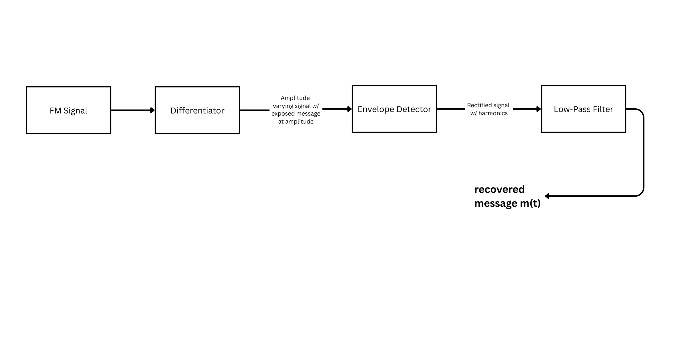

# FM_Demodulation_Differentiator_Design
Analog FM demodulator design using a differentiator-based detector circuit with op-amp implementation, envelope detection, and active low-pass filtering. Simulated and validated in NI Multisim and lab hardware to recover an 80 Hz message from a 40 kHz carrier. 

# FM Demodulation – Differentiator-Based Detector

## 📘 Overview
This project implements a **differentiator-based FM demodulator** that converts frequency deviations of an FM signal into amplitude variations, allowing recovery of the original message signal using simple analog techniques. The system is composed of three main stages: a differentiator circuit, an envelope detector, and a low-pass filter.  

The circuit was designed, simulated, and verified in **NI Multisim**, then built and tested experimentally to validate its ability to demodulate an FM signal centered at **fc = 40 kHz** with a **message frequency of 80 Hz**.

---

## ⚙️ System Architecture

### 1️⃣ Differentiator Circuit
- Converts frequency variations into amplitude variations (FM → AM conversion).
- Implemented using a practical op-amp differentiator with a frequency compensation network.  
- Operates effectively between **10 kHz – 100 kHz** to accommodate the carrier frequency range.
- Observed AM-like waveform at differentiator output, proportional to instantaneous frequency.

### 2️⃣ Envelope Detector
- Diode + RC network extracts the amplitude envelope proportional to the message signal.  
- Designed with **R = 10 kΩ** and **C = 0.01 μF** for smooth rectification.  
- Acts as the AM demodulator stage for the differentiated signal.

### 3️⃣ Low-Pass Filter (LPF)
- Second-order active low-pass filter with **3.3× gain** and **fc ≈ 100 Hz**.  
- Filters out carrier and high-frequency noise, outputting the recovered baseband message.  
- Implemented with **C = 0.01 μF**, **Rf = 33 kΩ**, **Rin = 10 kΩ**.

---

## 🧩 Circuit Design Summary

| Stage | Description | Component Values | Result |
|:------|:-------------|:----------------:|:-------|
| Differentiator | Op-amp based, FM→AM conversion | R = 10 kΩ, C = 0.01 μF | Output resembles AM waveform |
| Envelope Detector | Diode + RC | R = 10 kΩ, C = 0.01 μF | Extracted message envelope |
| Low-Pass Filter | 2nd order active filter | Rf = 33 kΩ, Rin = 10 kΩ, C = 0.01 μF | Smooth 80 Hz output |

---

## 🧪 Results & Observations
- **Carrier Frequency (fc):** 40 kHz  
- **Message Frequency (fm):** 80 Hz  
- **Modulation Index (β):** ~50 (for clear demodulation)  
- **Output:** Recovered sine wave around 79–81 Hz — nearly perfect match with original message.  
- Differentiator frequency range extended up to ~363 kHz (-3dB cutoff).  
- Increasing modulation index improved clarity; small deviations caused distortion.  

**Result:** The demodulator successfully recovered the message tone with minimal distortion, verifying the differentiator-based FM demodulation principle.

---

## 🧰 Tools Used
- **NI Multisim** – Circuit simulation and frequency response verification  
- **Analog Lab Equipment** – Oscilloscope, function generator, DC supply  
- **MATLAB** – Analytical modeling and signal visualization (optional)

---

## 🧠 Key Takeaways
- FM demodulation can be achieved using analog differentiation followed by envelope detection and filtering.
- Differentiator design range (10–100 kHz) is critical for maintaining waveform integrity.
- The envelope detector and low-pass filter stages work identically to AM demodulation once FM is converted to amplitude variation.

